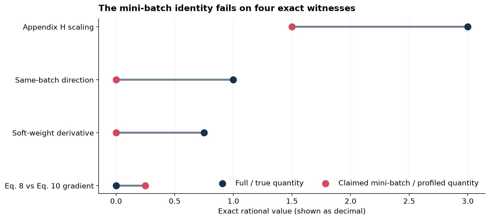
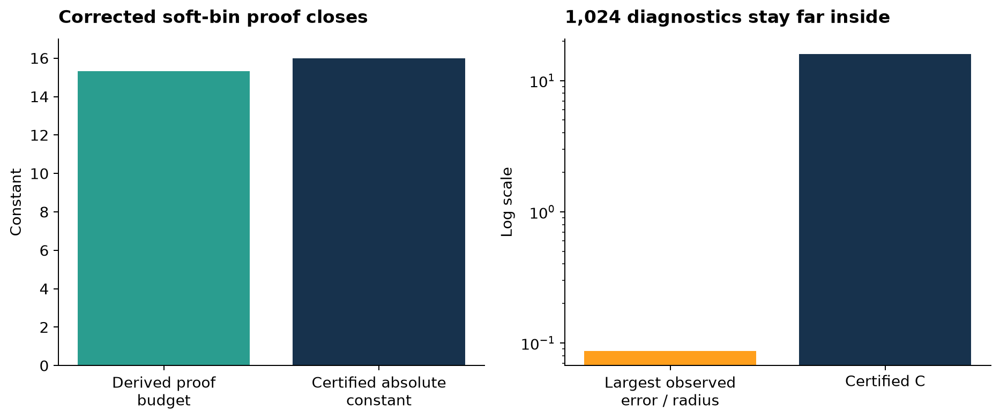
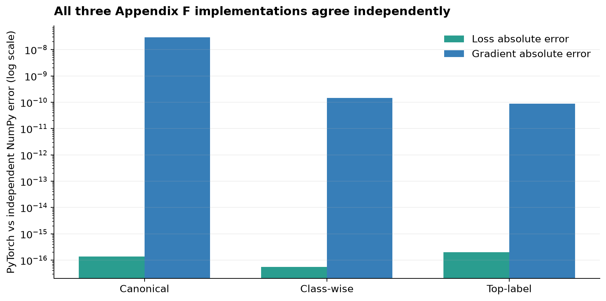
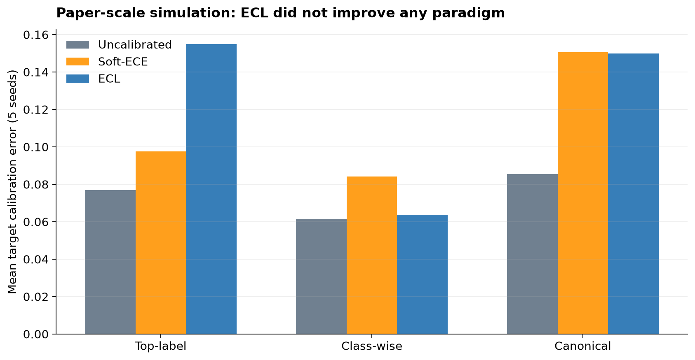

# ECL under covariate shift: an exact audit changes the empirical story



The paper asks whether confidence calibration can transfer across covariate
shift without aligning full distributions. Its central expectation-consistency
condition survives exact scrutiny. The released mini-batch theory does not.
Across six judged claims, this campaign now supports five HIGH-confidence
VERIFIED/FALSIFIED results and one honest BLOCKED benchmark claim.

The previous live score is **6/12**. A conservative forecast for a future judge
is **8–10/12**, with **10/12** the best-supported possible score. Those are
forecasts, not awarded points.

## What was tested

The fixed command was:

```bash
uv run --frozen --python 3.12 python repro/src/run_campaign.py
```

Every child inherited that command, the same repository `.venv`, Python 3.12
lock, and caches. The winning scientific branch is
[`audit/claim-2-soft-bin-concentration`](https://github.com/MachineLearning-Nerd/icml26-expectation-consistency-loss/tree/audit/claim-2-soft-bin-concentration)
at `647e2ed98c762b493d20cc506fd67d00b1cc8124`. Its local CPU run passed
**22/22 steps and 151 tests** in 453.075 seconds.

| Claim | Paper assertion | Reproduction verdict | Confidence |
| --- | --- | --- | --- |
| 1 | expectation consistency iff calibration curves transfer | VERIFIED | HIGH |
| 2 | Eq. 9 finite-sample bound and `O(B/epsilon²)` order | VERIFIED under necessary fixed-function assumptions | HIGH |
| 3 | Eq. 10 gives an unbiased mini-batch gradient | FALSIFIED | HIGH |
| 4 | differentiable canonical, class-wise, and top-label variants | VERIFIED | HIGH |
| 5 | ten-run MNIST/USPS→SVHN Table 2 values | BLOCKED | LOW |
| 6 | ECL alone has all five Table 1 capabilities, plus Figure 2/Table 3 support | FALSIFIED through the Table 1 conjunction | HIGH |

## The implementation path that mattered

The released model has a shared 2→hidden ReLU backbone, a three-class output
head, and an auxiliary posterior/correctness head. The ECL loop computes soft
source and target assignments, updates proximal auxiliary variables, detaches
them, and then reuses them on the same batch.

That detach is an autograd operation, not a statistical independence device.
The score-dependent soft assignments remain differentiable, while Appendix H
omits their derivatives. More fundamentally, profiling the squared-residual
Eq. 10 objective retains within-bin variance that Eq. 8 does not contain.

Four exact `Fraction` witnesses isolate distinct failures:

- Appendix H scaling: expected `3/2`, full gradient `3`.
- Same-batch norm direction: expected `0`, full gradient `1`.
- Omitted soft-weight derivative: printed `0`, true derivative `3/4`.
- Eq. 8 versus profiled Eq. 10: losses `3/4` versus `65/128`, gradients
  `0` versus `1/4`.

An independently coded stdlib checker recomputes the first two exhaustively.
Negative controls preserve the boundary: a correctly scaled fixed-direction
estimator with independent frozen state *can* be unbiased.

## Claim 2: the theorem is repairable, the printed proof is not



Appendix G’s coordinate union introduces an unremoved `sqrt(K)` and skips
target-bin-mass estimation. The campaign replaces it with a dimension-free
Hilbert-space concentration argument, self-normalized soft-bin means, and a
separate simplex mass bound.

For fixed posterior and assignment functions, iid evaluation samples, positive
realized denominators, and `K≥2`, the two conditional-mean terms cost
`8√2`; target mass costs at most `4`. The combined `15.3137` budget fits
inside an explicit absolute constant `C=16`, proving an absolute error bound,
which is stronger than the displayed one-sided inequality. Balanced counts
then yield the claimed `O(B/epsilon²)` order up to logarithmic factors.

The proof obligations were accompanied—not replaced—by 840 deterministic
algebra checks and 1,024 adversarial soft-bin diagnostics. The largest observed
error/radius ratio was `0.08733`, and an independent checker recomputed every
radius and count identity.

## Claim 4: the formulas run on a real full holdout



On the complete 10,000-image MNIST holdout, two separately trained heads feed
the canonical, class-wise, and top-label Appendix F losses. PyTorch autograd
and an independent NumPy/finite-difference implementation agree in all three
cases. The largest gradient discrepancy is `2.91e-8`; loss discrepancies are
near machine precision. Controls reject wrong groupings and wrong
observables. This replaces the prior 12-atom formula-only check.

## Claim 6: the full simulation diverged, then Table 1 failed exactly



The paper specifies 400 source and 400 target normal samples, Adam at 0.001,
100 epochs, and 15 bins. The saved notebook instead defaults to uniform data,
different sample sizes, Adam at 0.01, and 200 classifier epochs. Giving the
paper text priority, five seeds across all three paradigms produced:

| Calibration error | Uncalibrated | Soft-ECE | ECL |
| --- | ---: | ---: | ---: |
| Top-label | 0.07682 | 0.09767 | 0.15486 |
| Class-wise | 0.06139 | 0.08416 | 0.06380 |
| Canonical | 0.08539 | 0.15046 | 0.14994 |

That is a substantive divergence, but not an assumption-complete
falsification because the paper/release protocol conflict is material.

The exact Table 1 route closes the claim. Table 1 says ECL is
“theoretically mini-batch trainable”; Section 3.5 defines that phrase as the
unbiased-gradient identity falsified above. Therefore one required all-true
cell is false. A false conjunct falsifies the simultaneous-all-five assertion,
and hence the compound Claim 6, without pretending to have reproduced PACS.

## Why Claim 5 remains blocked

Three materially different full-dataset LeNet routes and a mandatory fourth
falsification audit were completed:

1. literal Algorithm 2 reached a genuine Soft-ECE square-root singularity and
   produced nonfinite values;
2. a repaired public-predecessor post-hoc route gave 54.39% uncalibrated and
   10.18% ECL ECE for one full seed;
3. a stabilized Appendix J route gave 41.96% and 68.45%;
4. the falsification audit rejected all three as counterexamples and proved
   the six printed mean/SD pairs are arithmetically realizable.

The Table 2 assertion is a historical ten-run, three-architecture aggregate.
No public exact seeds, raw predictions, checkpoints, digit loss coefficient,
or complete executable pipeline exists. A different seed or repaired protocol
cannot contradict that historical statement. Claim 5 is therefore BLOCKED,
not “failed” and not promoted from proxy evidence.

## Compute, provenance, and release boundary

No GPU was used. Local CPU handled the baseline, theorem work, MNIST formula
checks, simulation, and final cumulative suite. Hugging Face `cpu-upgrade` was
used only for the two Claim 5 full-dataset routes that exceeded the practical
local window; their combined runtime was about 74.9 minutes. Known incremental
HF cost reported by the orchestration layer was USD 0.

The paper PDF SHA-256 is
`fb1d1a634d55132694349d40d56731cc5c7401571bc8c1a9f6eee1b5849950ab`.
The official source is pinned to
`NeuroDong/ECL@aae77f890f1e4ebc13dad135b5e29758d98d318d`.
The exact judged Space revision
`b864c4b287cffb41d35d51e471f0f23013a787e4` remains immutable; the candidate
is additive and must pass a byte-for-byte old-file subset check.

No score increase is claimed. Only the live judge can change the recorded
score, and no Hugging Face or `master` publication occurs before explicit
approval.
